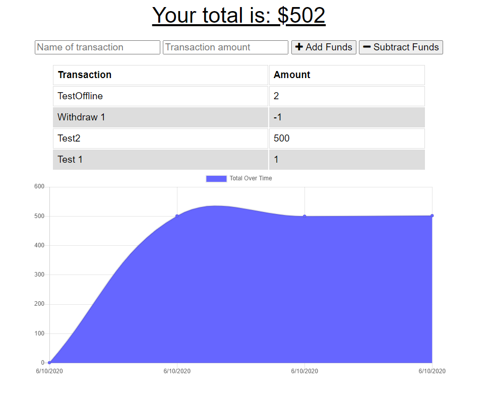

# budget-tracker

## Description

This is an application that allows users to track their budget expenses online and offline. It combines the ability to input your transaction and respective transaction amount into the tracker - this application will work online and offline.

Technologies utilised to create this application include:

- Javascipt
- Node.js
- Express.js
- PWA
- MongoDB
- Mongoose.js
- heroku

## Deployment

This application has been deployed across Heroku, you can view this here:

## Application Preview

Preview of the application below:

